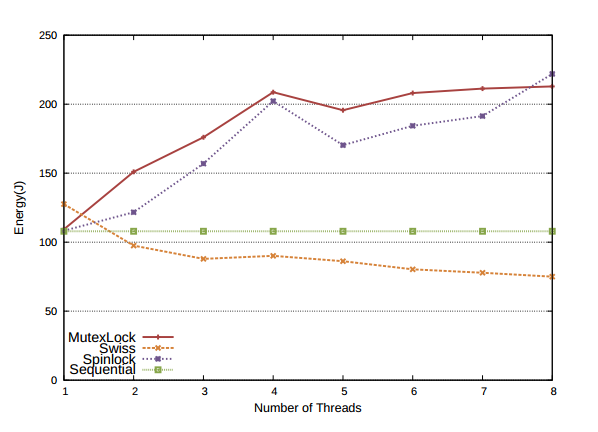

# About Me

Am currently pursuing my PhD at IIT Madras. My area of research is Software Aspects of VLSI.
My primary area of interest is in developing efficient heuristics for low power VLSI.
I have also worked on heuristics for various post synthesis stages like partitioning,placement and routing,
as a part of my course projects. My other areas of interest include Computer Architecture and Parallel Algorithms.

# Awards 
# Publications:
   <table width="100%" align="center" border="0" cellspacing="0">
   <tr text-align="justify"><h3>Efficient Vt-Assignment to Minimize Circuit Leakage using Adaptive Lazy Timing Analysis</h3><h5><i><b>  Design Automation Conference, 2014 </b></i></h5>
   <h5> Patanjali SLPSK, Seetal Potluri and V. Kamakoti</h5></tr>
    <tr>
      <td width="30%">
               
      </td>
      <td valign="top" width="70%"> 
        
 <h6>We consider the timing-constrained discrete Vt-assignment problem for leakage minimization in digital circuits. The problem is known to be NP-complete. Greedy or Sensitivity-driven heuristics are known to be very effective for iterative Vt-assignment, with incremental timing analysis performed between the iterations. These heuristics, while offering good leakage power savings, carry a huge run-time penalty with increase in circuit size.

In iterative Vt-assignment, we observe that there is a good correlation between the slack distribution in a given iteration, and the order of gate replacements in subsequent iterations. This paper proposes an algorithm, which exploits this high correlation to speed up the Vt-assignment process. The proposed algorithm uses gate replacement windows, with lazy timing evaluation, to reduce the total number of incremental STA runs during the optimization. At the end of each iteration, the successive window size is dynamically scaled up/down based on the timing updates at the end of the current window. The proposed algorithm, when applied to ISCAS/ITC circuits, significantly reduced the run-time without impacting the solution quality.
. </h6>
</td></tr>
   </table>
   <table>
   <tr text-align="justify"><a href="https://www.usenix.org/conference/hotpower12/workshop-program/presentation/gautham"><h3>The Implications of Shared Data Synchronization Techniques on Multi-Core Energy Efficiency</h3></a><h5><i><b> HotPower, 2012 </b></i></h5>
   <h5> Ashok Gautham, Kunal Korgaonkar, Patanjali SLPSK, Shankar Balachandran, and Kamakoti Veezhinathan</h5>

   </tr>
    <tr>
      <td width="30%">
               
      </td>
      <td valign="top" width="70%"> 
        
 <h6> Shared data synchronization is at the heart of the multi-core revolution since it is essential for writing concurrent programs. Ideally, a synchronization technique should be able to fully exploit the available cores, leading to improved performance. However, with the growing demand for energy-efficient systems, it also needs to work within the energy and power budget of the system. In this paper, we perform a detailed study of the performance as well as energy efficiency of popular shared-data synchronization techniques on a commodity multi-core processor. We show that Software Transactional Memory (STM) systems can perform better than locks for workloads where a significant portion of the running time is spent in the critical sections. We also show how power-conserving techniques available on modern processors like C-states and clock frequency scaling impact energy consumption and performance. Finally, we compare the performance of STMs and locks under similar power budgets. </h6>
</td></tr>
   </table>

# Academic Details
I have completed my B.Tech from Pondicherry Engineering College, Pondicherry in Electrical, Electronics and Communications Engineering in 2011.

# Contact:
patanjali [dot] slpsk [at] gmail[dot]com
